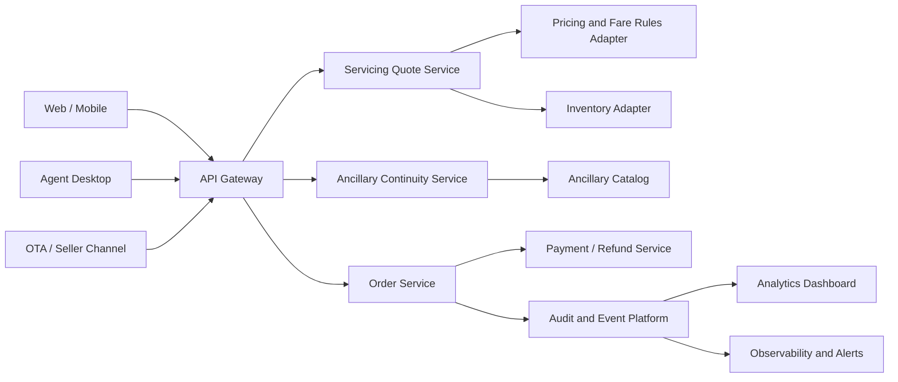

# Smart Order Servicing and Ancillary Continuity

**Public Airline Retailing Product Owner Case Study**

This repository is a public portfolio simulation for a **Technical Product Owner - Offer, Order, Ancillary, and Distribution** role. It demonstrates airline retailing product thinking across customer problem discovery, backlog ownership, API design, NFRs, technical debt, PI planning, metrics, and modern Offer-and-Order concepts.

## Disclaimer

This is a portfolio simulation based on publicly observable airline retailing patterns and industry concepts. It does **not** use internal airline data, confidential information, or claim employment experience with any airline. Carrier names used in this repository are fictional placeholders for anonymized benchmarking.

## Anonymized Benchmark Framing

| Placeholder | Meaning in this case study | Why it is used |
|---|---|---|
| **Aureon Air** | Focus airline persona: a premium global hub carrier with strong direct booking, manage-booking, and ancillary retailing capabilities | Keeps the case study realistic without naming a real airline |
| **Nexora Airways** | Competitor benchmark persona: a premium network competitor with strong digital trip management and seller/distribution capabilities | Allows competitor-style comparison without implying internal research access |

## Core User Problem

Airline customers can usually search, book, and add extras online, but servicing becomes confusing when they need to change, split, cancel, or refund a booking. The pain is strongest when paid ancillaries are involved: seats, extra baggage, meals, lounge, Wi-Fi, chauffeur-like services, or special assistance.

The customer does not only ask, **“Can I change my flight?”** They ask:

- What happens to my paid seat?
- Can extra baggage move to the new flight?
- Do meals need to be selected again?
- Can I change one passenger without changing the whole family booking?
- Will paid extras be refunded automatically or separately?
- Why does the agent or seller channel show a different option from the direct channel?

## Proposed Solution

**Smart Order Servicing and Ancillary Continuity Hub**

A unified servicing layer that gives customers, agents, and partner sellers a consistent view of order state, passenger-level servicing eligibility, change quote, refund quote, and ancillary continuity before confirmation.

## Repository Structure

```text
README.md
docs/case-study.md
docs/user-stories.md
docs/nfr-technical-debt.md
docs/pi-planning.md
docs/resume-linkedin-snippets.md
api/openapi.yaml
backlog/backlog.csv
```

## Architecture View



## Offer-to-Order-to-Servicing Flow


## Product Metrics with Example Targets

| Metric | Target |
|---|---:|
| Self-service change completion | +20% |
| Contact center contacts for seat/baggage confusion | -15% |
| Change quote abandonment | -10% |
| Ancillary retention after itinerary change | +12% |
| Order servicing API error rate | <1% |
| P95 order retrieve latency | <1.5 sec |
| P95 change quote latency | <3 sec |
| Duplicate payment/refund incidents caused by retries | 0 critical incidents |

## What This Demonstrates

- Product discovery from a realistic airline retailing scenario
- Public benchmark translation into an anonymized portfolio artifact
- Offer, Order, Ancillary, and Distribution domain understanding
- PSPO-style Product Owner discipline: Product Goal, backlog ordering, acceptance criteria, transparency, inspection, and adaptation
- SAFe-style delivery thinking: economic prioritization, systems thinking, flow, cadence, PI objectives, dependencies, and risks
- Technical Product Owner depth: OpenAPI contracts, NFRs, idempotency, security, observability, and structured errors

## Reference Sources for Industry and Delivery Concepts

- IATA Airline Retailing: https://www.iata.org/en/programs/airline-distribution/retailing/
- Scrum Guide: https://scrumguides.org/scrum-guide.html
- SAFe Lean-Agile Principles: https://framework.scaledagile.com/safe-lean-agile-principles/
- SAFe Product Owner: https://framework.scaledagile.com/product-owner/
